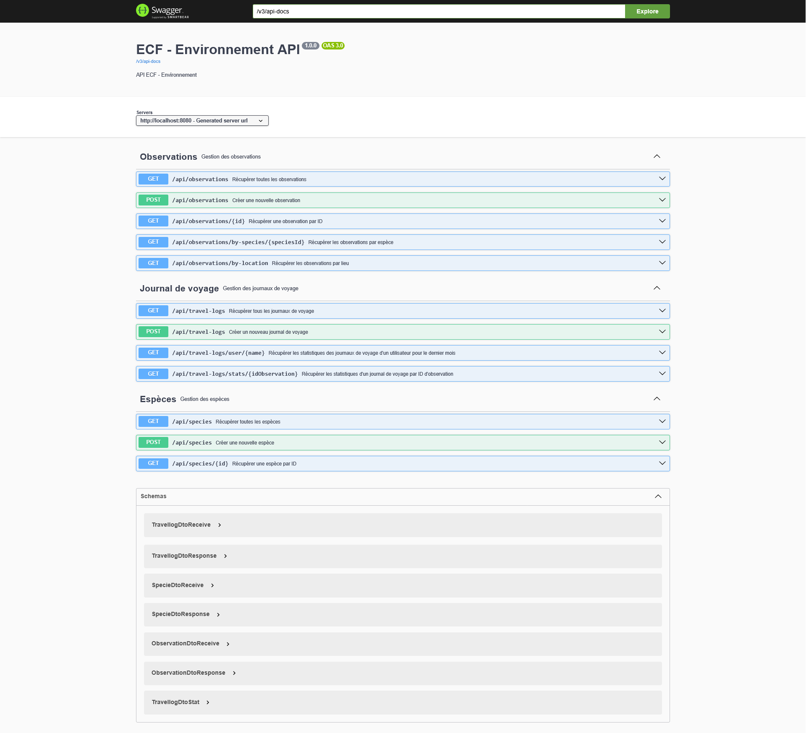

# 🌱 Spring - ECF2

## 📅 Date de l'examen : 22/08/2025

Ce repository regroupe l'ECF réalisé dans le cadre de l’apprentissage de **Spring**.

---

## 📸 Capture d'écran


---

## 🧰 Stack & Prérequis

* **Java 17+**
* **Maven 3+**
* **Spring Boot 3+**
* **Docker & Docker Compose**
* **MySQL** (via conteneur)

> Ports par défaut : Application `:8080`, MySQL `:3307`.

---

## 🚀 Démarrage rapide

### 1) Cloner le repository

```bash
git clone https://github.com/AxelDemeyere/EFC2_Spring
```

### 2) Lancer la BDD (MySQL)

```bash
docker compose up -d
```

> Cela démarre notamment un conteneur **MySQL** nommé `ecf2_spring`.

### 3) Créer la base de données `environement_db`

Se connecter au conteneur MySQL :

```bash
docker exec -it ecf2_spring mysql -u root -p
# Mot de passe : password
```

Dans le client MySQL :

```sql
CREATE DATABASE environement_db;
SHOW DATABASES;
```
